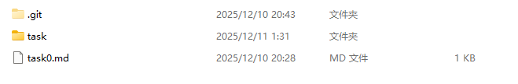

#**task0**#

1.我使用git init 在我的本地作业仓库完成了初始化，现在我的本地仓库存在.git隐藏文件。

2.我把我的本地作业仓库中的.git文件截图，然后将这张png文件放在本地仓库里，使用git add将这张图片添加到暂存区。

3.我使用git commit提交更改到本地仓库

4.我将暂存区的图片使用git push上传到我的github仓库的master分支

5.

